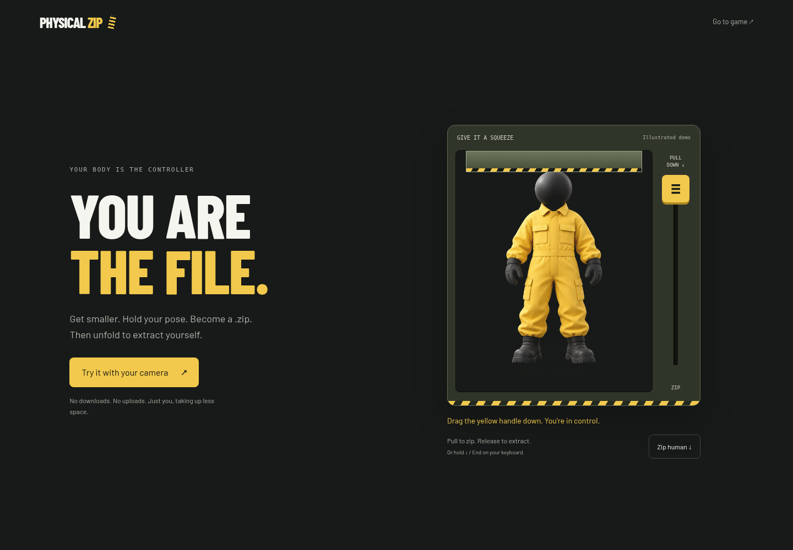
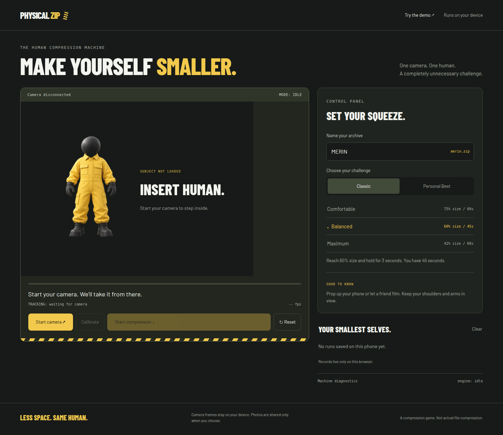
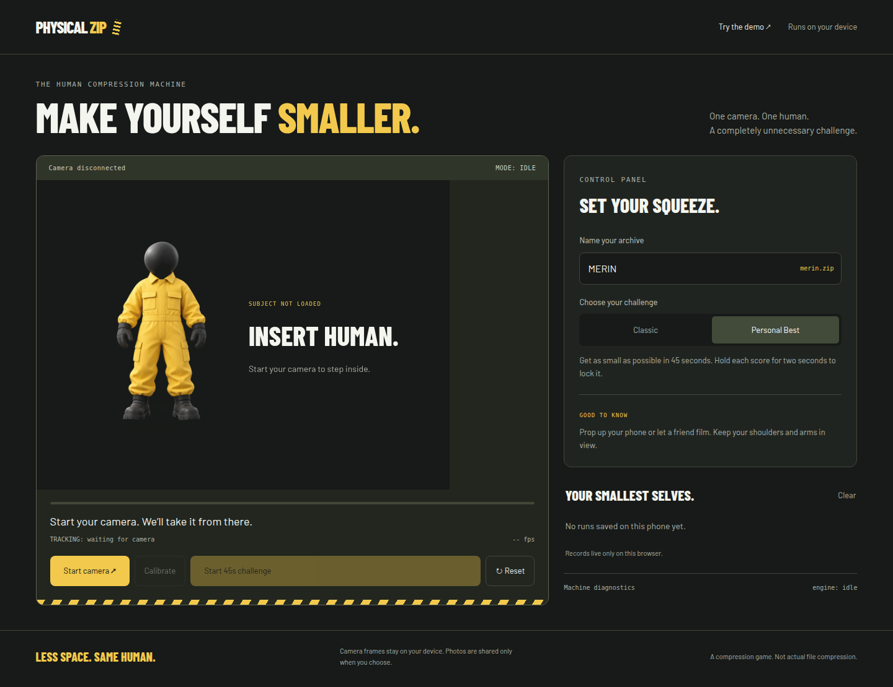
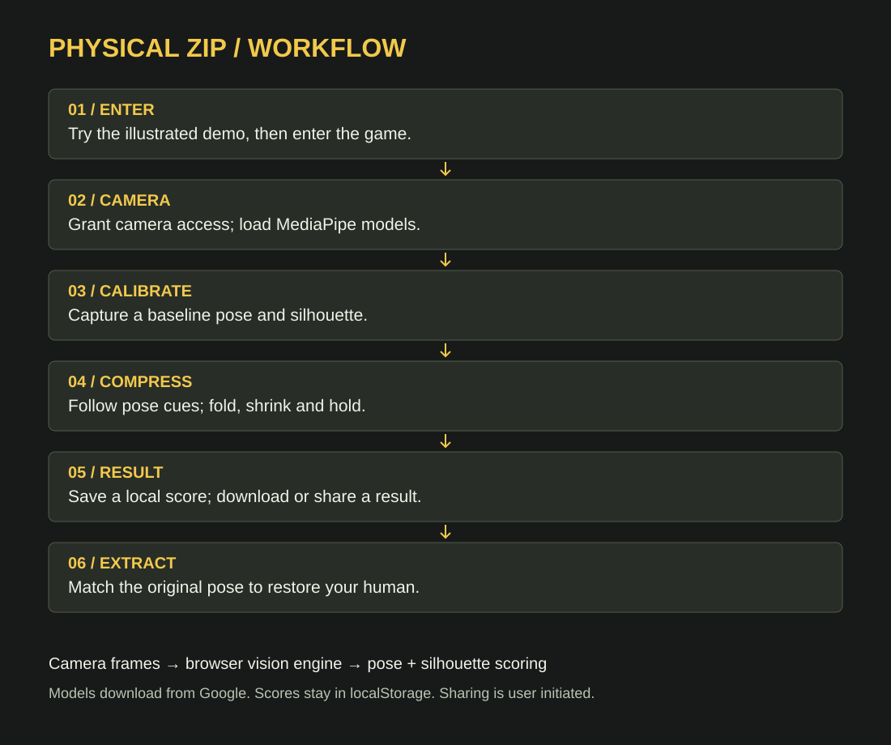
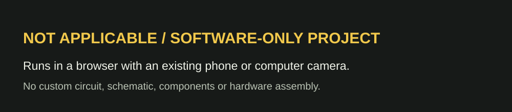

# PHYSICAL ZIP 🎯


## Basic Details
### Team Name: meow


### Team Members
- Team Lead: Mevin Benty - Sahrdaya College Of Engineering And Technology
- Member 2: Merin Elizabeth Edgar - Sahrdaya College Of Engineering And Technology

### Project Description
PHYSICAL ZIP is a browser-based human compression game: your body is the controller, and you are the file.
Use your camera to calibrate a starting pose, follow live coaching to make yourself smaller, and hold your pose to become a pretend `.zip`.
Then match your original pose to extract yourself, save a local score, and download a certificate or share a result card.

### The Problem (that doesn't exist)
Files get to be zipped, but humans keep taking up their entire uncompressed amount of space. Why should a PDF enjoy better storage efficiency than you? PHYSICAL ZIP tackles the completely imaginary crisis of people having too much unnecessary whitespace.

### The Solution (that nobody asked for)
We turn your camera into a deeply unnecessary compression machine. MediaPipe tracks your pose and silhouette while a bossy digital coach asks you to tuck your elbows, bend your knees, crouch and turn sideways. Classic mode offers Comfortable (75% size, 2-second hold, 60 seconds), Balanced (60%, 3-second hold, 45 seconds), and Maximum (42%, 5-second hold, 60 seconds). Personal Best gives you 45 seconds to lock your smallest pose with a 2-second hold. The percentage is a game score derived from body folding and silhouette changes, not a measurement of physical volume. Your reward is a pretend human archive; extraction means unfolding back into your original pose. The certificate is a `.zip.txt` text file, not an actual ZIP archive.

## Technical Details
### Technologies/Components Used
For Software:
- Languages: TypeScript, HTML and CSS; browser JavaScript generated by Vite.
- Frameworks: Vite 7 for development and production bundling; Tailwind CSS 4 through the Vite plugin; native DOM-based UI.
- Libraries: `@mediapipe/tasks-vision` 0.10.35 for Pose Landmarker and Image Segmenter; `@playwright/test` for browser UI checks.
- Tools: Node.js, npm, TypeScript compiler, Git, Playwright, browser Canvas/Web Audio/MediaDevices/Web Share APIs, and localStorage. The repository includes Vercel deployment configuration.

For Hardware:
- Not applicable: this is a software-only project. It uses an existing phone camera or computer webcam.
- No custom hardware specifications. Camera capture requests 640 × 480 video, with device-supported fallback; audio capture is disabled.
- No hardware tools required. Use a camera-enabled browser on localhost or HTTPS and an internet connection to download the vision models.

### Implementation
For Software:
# Installation
Install Node.js 22.12+ and npm, then run:

```bash
git clone https://github.com/Meliza1009/useless_project_temp.git
cd useless_project_temp
npm ci
```

The vision runtime and fonts are bundled locally. Pose and segmentation models download from Google when the camera engine initializes; CDN runtime fallbacks are also configured. Camera frames are processed in the browser, and the best 20 score records are stored in this browser’s localStorage.

# Run
```bash
npm run dev
```

Open the local URL printed by Vite. Try the illustrated handle demo, enter the game, choose a mode, and click **Start camera**. Allow camera access, keep your shoulders and arms visible, calibrate your starting pose, then start compression and follow the coach. After a successful round, extract by matching your original pose or download your certificate. Result cards omit photos unless you enable **Include my photos in the shared card**.

To build and preview the production version:

```bash
npm run build
npm run preview
```

Build verification: the current checkout fails `npm run build` in `src/main.ts` because of a function argument-count mismatch and unresolved `pickCue` / `cueCycle` references. These application issues must be resolved before generating a production build. The screenshots were captured using the Vite development server.

To run the existing browser UI checks:

```bash
npx playwright install chromium
npm run test:ui
```

Camera access requires localhost or HTTPS. If opening the app on a phone, serve it over HTTPS; an ordinary HTTP LAN address will not provide camera access.

### Project Documentation
For Software:

# Screenshots (Add at least 3)

*The interactive illustrated introduction: drag the yellow handle or use the Zip human button to compress the character, then release or toggle to extract.*


*Classic mode before camera activation, showing the compression chamber, archive name, three difficulty settings, camera controls and local records.*


*Personal Best mode before camera activation, showing the 45-second challenge setup. Screenshots show real interface states; no camera scores or footage have been fabricated.*

# Diagrams

*Enter → enable camera → load vision models → calibrate → compress with pose and silhouette feedback → save or share results → extract by matching the original pose. Inference runs in the browser; extraction uses available pose tracking, silhouette matching, or a manual confirmation fallback.*

For Hardware:

# Schematic & Circuit

*Not applicable: there is no custom circuit. The browser accesses the device camera through the MediaDevices API.*


*Not applicable: no electrical schematic is required. The software workflow is documented above.*

# Build Photos

*Not applicable: no hardware component assembly. An existing phone or computer and its camera are the only physical equipment used.*


*Not applicable to hardware. For the software build, install dependencies with `npm ci` and run `npm run build` to generate `dist/`.*


*The final product is the browser interface shown above, before camera activation. No physical hardware was built.*

### Project Demo
# Video

https://github.com/user-attachments/assets/2416c7a8-3df4-4032-99a7-adf027d4e7a5

*A real camera gameplay recording showing baseline calibration, live pose tracking, and a successful compression round with the player reaching 67% size (33% saved).*

# Additional Demos
[Interactive demo source](src/ui/intro.ts) · [Browser interaction checks](tests/frontend.spec.ts) · [Workflow diagram](docs/workflow.svg). Run the app locally to try the illustrated demo without camera access. [Live hosted demo](https://uselessprojecttemp-lac.vercel.app/).

## Team Contributions
- Mevin Benty (mevinb): Built the interactive compression introduction with drag, keyboard and toggle controls; redesigned the machine interface; added mobile gameplay, camera switching, Personal Best mode, local score records and shareable result cards; integrated demo artwork and self-hosted fonts; and added Playwright coverage for interactions and responsive layouts. Based on team commits `f9d5966` and `cd2335f`.
- Merin Elizabeth Edgar (Meliza): Built the initial Vite, TypeScript and MediaPipe application, including pose tracking, segmentation, compression coaching, extraction and certificates; added partial-body calibration and pose/silhouette/manual extraction support; improved combined pose scoring, distance checks and before/after compression proof; fixed camera startup, tracking responsiveness and calibration flow; self-hosted the MediaPipe WASM runtime with fallback sources; and configured the initial static deployment. Based on team commits `7ee922c`, `f8b5e06`, `c0edf29`, `cc1f91f`, `b7e42af`, `aa28bd3`, `cd5adfd`, `a9c6592`, `5e7db84` and `1a5d12f`.

---
Made with ❤️ at TinkerHub Useless Projects 


